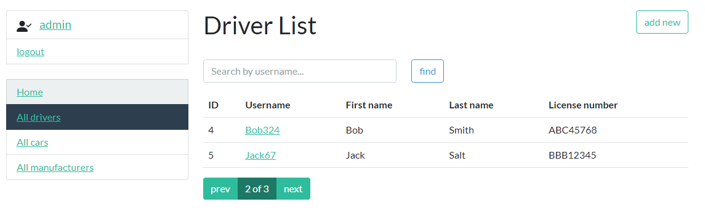
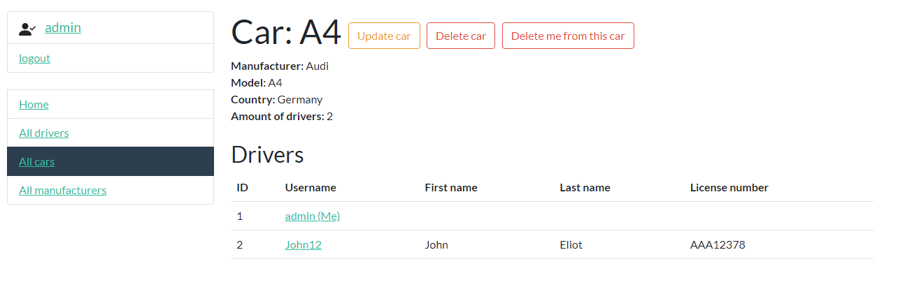

# Taxi service 

Django project for managing taxi service

## Check it out!

[project on heroku](link)
username:test_user
password:XfW9ADRupV5cZ9j

## Installing / Getting started

Python 3 must be already installed

```shell
git clone https://github.com/rotsen18/taxi-service.git
cd taxi-service
python -m venv venv
venv/scripts/activate
pip install -r requirements.txt
python manage.py runserver  # start Django project
```

## Features

* Authentication functionality for Driver/User
* Managing cars, drivers, manufacturers directly from website
* Admin panel for advanced managing

## Demo
)

